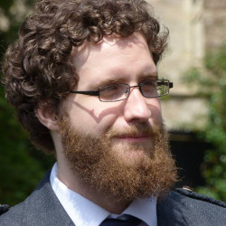

Hello, my name is Finlay Maguire.

I'm a jointly appointed Assistant Professor in [Community Health & Epidemiology](https://medicine.dal.ca/departments/department-sites/community-health.html) and [Computer Science](https://www.dal.ca/faculty/computerscience.html) at Dalhousie University. Pathogenomics Bioinformatics Lead at the [Shared Hospital Laboratory](https://www.shn.ca/marking-a-milestone-shared-hospital-laboratory-conducts-one-millionth-covid-19-test/), Steering Committee & Working Group Co-Chair for [PHA4GE](https://pha4ge.org/), Faculty in the [Institute for Comparative Genomics](https://icgenomics.ca/), and with an adjunct appointment at [Sunnybrook Research Institute](https://sunnybrook.ca/research/).

Our aim is to develop and collaboratively apply data-driven methods to try and mitigate health and social crises.
This is focused on two main areas: genomic epidemiolgy of infectious diseases and inter-disciplinary collaborations with domain experts.

Specifically, this former work involves developing and applying novel microbial bioinformatics and machine learning approaches to better understand the diagonsis, evolution, and dynamics of infectious diseases.
We largely work on problems related to antimicrobial resistance (AMR) and, in the last couple of years, the COVID-19 pandemic with national and international consortia of clinicians and public health experts.
Whereas, our broader collaborative data science works includes work exploring online radicalisation with sociologists, patient preference at refugee clinics, and autism-related language-use.

*To this end the majority of my updates will now be taking place on my [lab website](https://maguire-lab.github.io/) instead of this website.*

Before this my [doctoral research](http://finlaymagui.re/assets/finlay_maguire_final_PhD_2015_thesis.pdf) worked on finding optimal strategies for analysing large, complex, messy biological datasets from a variety of omic resources. 
This included the first ever analysis of *de novo* single cell transcriptomic datasets from multi-eukaryotic systems.  In the course of this work 
I developed several novel computational tools and methods for large scale biological data.

My full academic CV is available [here](http://finlaymagui.re/assets/Finlay_Maguire_CV_20230427.pdf) (last updated: 2023-04-27)
A one page version can be be found [here](http://finlaymagui.re/assets/Finlay_Maguire_CV_one_page_20230427.pdf).
