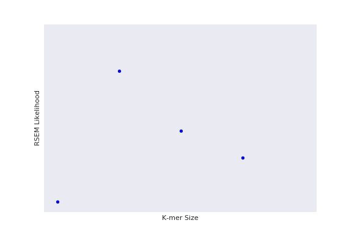
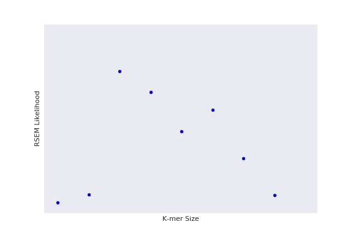
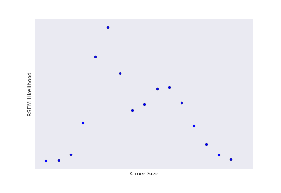
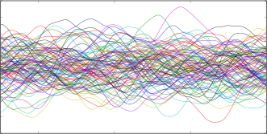
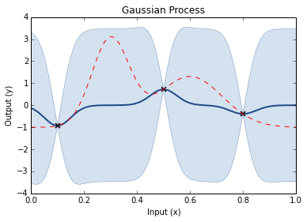
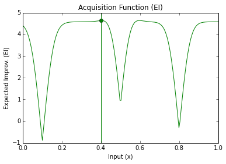
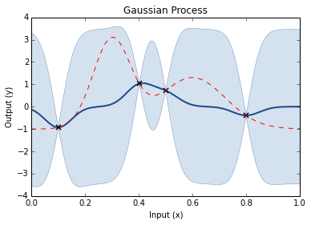
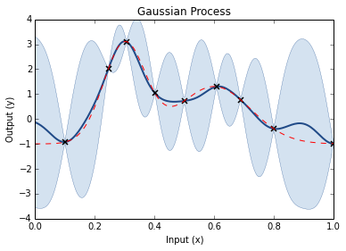
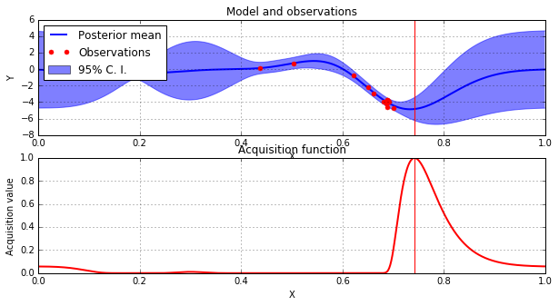

% Bayesian Optimisation for Experimental Design
% Finlay Maguire 
% root@finlaymagui.re

## Overview

- Parameter optimisation problems
- SpearSeq
- Recombinant gene expression

#Parameter Optimisation Problems in Biology

----

----

##In the lab

- Codon optimisation
- PCR conditions
- Protein purification (IPTG etc
- Chemical synthesis (reagent ratios/conditions/catalysts)
- Optimising brewing

----

##Computational problems

- Finding the optimal assembly (according to some metric)
- Training detection algorithms e.g. motifs, genes etc.
- Optimising clustering methods 

----

##Specific examples

- Given a protein of interest, which sequence will maximise expression? (e.g. $900nt = 300$ codons $\approx 2^{300}$ possible sequences)
- Given a set of sequencing data, which preprocessing/assembly parameters will produce the most likely assembly? 

#Naive experimental design (Grid Search)

----

----

----

----

----

----

#So how would you more efficient choose your datapoints?

---- 

## Probabilistically!

----

----

----

----

#Step through of optimisation

----

----

----

----

----

----

----

----

----

----

# Results

----

- SpearSeq found the optimal K-mer value (and other assembly parameters) for a test assembly in 3 trials
- Bayesian Optimisation of synthetic construct expression found 5' UTR free fold energy and 5' UTR length are the two most importantfeatures in expression of the synthetic gene (Gonzalez, 2015)

# Conclusion

- Bayesian Optimisation is a cutting edge method in probabilistic numerics
- Can be used for more efficient experimental design (saving time and money, and potentially
revealing hidden structure in the data)
- Several libraries and implementations of this for the general case
- Be eager to here experimental ideas from people that they think this might be applied to

