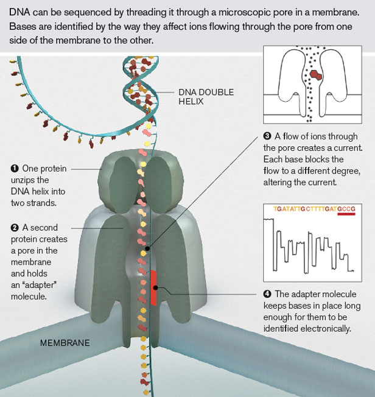

% I, for one, welcome our robot overlords.
% Finlay Maguire
% December 27th 2014 

# Science sucks

---

---

# Technology is improving

---

---

---

Aside about nanopore

# The robots are rising

---

---

---

## But that is still not enough

# Time to get SAAS-y

---

- web-based on-demand remote life science lab
- live results
- currently expanding... jobs available... tons of start-up funding

---

## Robots + Internet 

        run = requests.post(url("%s/runs" % PROJECT), json.dumps({
          "run": {
            "title": "Synthesize pri-F",
            "request": {
              "type": "synthesis",
              "sequence": {
                "sequence": "acatctgagcgagcgac",
                "name": "pri-F"
              }
            }
          }
        }), headers = headers).json()
        print run['id']

---

---

## Robots + Internet + Life

        {
          "title": "Incubate bacteria",
          "protocol": {
            "refs": {
              "plate1": {
                "id": "ct139xhhctkphy",
                "store": { "where": "cold_4" }
              }
            },
            "instructions": [
              {
                "op": "incubate",
                "object": "plate1",
                "where": "warm_37",
                "duration": "2:hour",
                "shaking": true
              }
            ]
          }
        }
---

# In summary:

---

- Science sucks to do
- Robots are awesome
- Robots + the internet are even more awesome
- Robots + internet + machine learning + utilitarian political philosophies = Bow down human worms.
